# Data Model — Star Schema Architecture
**Project:** Zenith Securitisation Risk Analytics & Financial Intelligence System
**Pool:** ZAAUTO2024-1 (Zenith Auto Receivables Trust 2024 Series 1)
**Modelling Approach:** Kimball-style star schema, optimised for Power BI's VertiPaq engine

---

## 1. Why a star schema?

VertiPaq compresses columnar data more efficiently when:
- High-cardinality keys are **integers** (surrogate keys, `DateKey` as `YYYYMMDD`)
- Wide narrative columns (state names, vehicle make/model) live in **dim** tables
- **Fact** tables hold only foreign keys + measures (the additive numbers)
- Relationships are **single-direction**, one-to-many, from dim → fact

This drives sub-second visual response on millions of rows. The model below is sized for 500 loans but scales to 5M+ without redesign.

---

## 2. Entity-Relationship Diagram

```mermaid
erDiagram
    DIM_CALENDAR ||--o{ FACT_LOAN : "OriginationDateKey"
    DIM_CALENDAR ||--o{ FACT_DPD_SNAPSHOT : "SnapshotDateKey"
    DIM_CALENDAR ||--o{ FACT_LOSS_MONTHLY : "ReportingDateKey"
    DIM_CALENDAR ||--o{ FACT_VINTAGE : "VintageStartDateKey"
    DIM_CALENDAR ||--o{ FACT_TRANCHE_CASHFLOW : "ReportingDate"
    DIM_CALENDAR ||--o{ FACT_WATERFALL : "ReportingDate"
    DIM_CALENDAR ||--o{ FACT_ECON_HISTORY : "ReportingDate"

    DIM_POOL ||--o{ FACT_LOAN : "PoolID"
    DIM_POOL ||--o{ FACT_DPD_SNAPSHOT : "PoolID"
    DIM_POOL ||--o{ FACT_VINTAGE : "PoolID"
    DIM_POOL ||--o{ DIM_TRANCHE : "PoolID"

    DIM_BORROWER ||--o{ FACT_LOAN : "BorrowerID"
    DIM_VEHICLE  ||--o{ FACT_LOAN : "VehicleKey"
    DIM_GEOGRAPHY ||--o{ FACT_LOAN : "GeoKey"
    DIM_SERVICER ||--o{ FACT_LOAN : "ServicerID"

    FACT_LOAN ||--o{ FACT_DPD_SNAPSHOT : "LoanID"

    DIM_TRANCHE ||--o{ FACT_TRANCHE_CASHFLOW : "TrancheID"
    DIM_TRANCHE ||--o{ DIM_INVESTOR : "TrancheID"
    DIM_TRANCHE ||--o{ FACT_STRESS_RESULTS : "TrancheID (where Stage in TR-A/B/C)"

    DIM_SCENARIO ||--o{ FACT_STRESS_RESULTS : "ScenarioID"

    DIM_ECON_INDICATOR ||--o{ FACT_ECON_HISTORY : "IndicatorCode"

    DIM_CALENDAR {
        int DateKey PK
        date Date
        int Year
        int Quarter
        string MonthYear
        string YearQuarter
        bool IsMonthEnd
        string FiscalYear
        string FiscalQuarter
    }
    DIM_POOL {
        string PoolID PK
        string PoolName
        string AssetClass
        decimal OriginalPoolBalance_INR
        decimal WAC_Pct
        decimal WAM_Months
    }
    DIM_BORROWER {
        string BorrowerID PK
        int BorrowerAge
        string EmploymentType
        decimal AnnualIncome_INR
        decimal DTI_Ratio
        int CIBIL_Score_Current
        string CIBILBand_Curr
    }
    DIM_VEHICLE {
        int VehicleKey PK
        string VehicleMake
        string VehicleModel
        int VehicleYear
        string VehicleType
    }
    DIM_GEOGRAPHY {
        int GeoKey PK
        string Region
        string State
        string StateTier
    }
    DIM_SERVICER {
        string ServicerID PK
        string ServicerName
        string ServicerType
        string ServicerRating
    }
    DIM_TRANCHE {
        string TrancheID PK
        string TrancheName
        int TrancheRank
        string CreditRating
        decimal CouponRate_Pct
        bool FirstLossPosition
    }
    DIM_INVESTOR {
        string InvestorID PK
        string InvestorName
        string InvestorType
        string TrancheID FK
        decimal InvestedAmount_INR
    }
    DIM_SCENARIO {
        string ScenarioID PK
        string ScenarioName
        decimal PD_Multiplier
        decimal LGD_Multiplier
        decimal UnemploymentShock_Pct
        int InterestRateShock_bps
    }
    DIM_ECON_INDICATOR {
        string IndicatorCode PK
        string IndicatorName
        string Source
    }
    FACT_LOAN {
        string LoanID PK
        string PoolID FK
        string BorrowerID FK
        int VehicleKey FK
        int GeoKey FK
        string ServicerID FK
        int OriginationDateKey FK
        decimal OriginalLoanAmount
        decimal CurrentBalance
        int IFRS9_Stage
        decimal PD_Estimate
        decimal LGD_Estimate
        decimal ECL_Provision
    }
    FACT_DPD_SNAPSHOT {
        int SnapshotDateKey FK
        string LoanID FK
        string PoolID FK
        int DPD_Days
        string DPD_Bucket
        string DPD_Bucket_Prior
        decimal CurrentBalance
        string RBI_SMA_Class
    }
    FACT_LOSS_MONTHLY {
        int ReportingDateKey PK
        decimal BOP_Balance
        int NewDefaults_Count
        decimal NetLoss_ThisMonth
        decimal CPR_Annualised
        decimal ExcessSpread_Monthly
    }
    FACT_VINTAGE {
        string VintageID PK
        int VintageStartDateKey
        int MonthsOnBook PK
        decimal CumulativeNetLossRate
        decimal MarginalLossRate
    }
    FACT_TRANCHE_CASHFLOW {
        date ReportingDate
        string TrancheID FK
        decimal BOP_Balance
        decimal InterestPaid
        decimal PrincipalPaid
        decimal LossAllocated
        decimal EOP_Balance
    }
    FACT_WATERFALL {
        date ReportingDate
        string Step
        decimal Amount
    }
    FACT_STRESS_RESULTS {
        string ScenarioID FK
        string Stage
        int LoanCount
        decimal ECL_Baseline_INR
        decimal ECL_Stressed_INR
        decimal ECL_Increase_INR
    }
    FACT_ECON_HISTORY {
        date ReportingDate FK
        string IndicatorCode FK
        decimal Value
    }
```

---

## 3. Tables & cardinality

### Dimensions (lookup tables)

| Table | Grain | Rows | Purpose |
|---|---|---:|---|
| `dim_calendar` | one row per date | 4,383 | Time intelligence, fiscal year (Apr–Mar Indian standard), month-end flags |
| `dim_pool` | one row per securitisation pool | 1 | Pool master: balance, WAC, ratings, trustee |
| `dim_borrower` | one row per borrower | 500 | Demographics, credit profile, banded for slicing |
| `dim_vehicle` | one row per make/model/year/type | 393 | Collateral master |
| `dim_geography` | one row per Region × State | 19 | Geo hierarchy + RBI tier classification |
| `dim_servicer` | one row per servicer | 3 | Bank/NBFC, rating, backup servicer |
| `dim_tranche` | one row per tranche | 3 | Class A/B/C – rating, coupon, subordination |
| `dim_investor` | one row per investor-tranche | 8 | Investor base, allocation %, FPI flag |
| `dim_scenario` | one row per stress scenario | 5 | Multipliers + macro shocks (BASE/MILD/MOD/SEVERE/CRISIS) |
| `dim_economic_indicator` | one row per macro indicator | 8 | Macro definitions (GDP, CPI, REPO, UNEMP, …) |

### Facts (event/measure tables)

| Table | Grain | Rows | Purpose |
|---|---|---:|---|
| `fact_loan` | one row per loan | 500 | Loan-level snapshot at cutoff; IFRS 9 stage, PD/LGD/EAD/ECL |
| `fact_dpd_snapshot` | one row per loan × snapshot date | 6,000 | Monthly DPD bucket transitions, cure/roll flags, RBI SMA class |
| `fact_loss_monthly` | one row per reporting date | 12 | Portfolio loss waterfall, default rates, CPR, excess spread |
| `fact_vintage` | one row per vintage × MOB | 375 | Static-pool curves: cumulative defaults, losses, prepayments |
| `fact_tranche_cashflow` | one row per tranche × reporting month | 36 | Interest, principal, loss allocation per tranche |
| `fact_waterfall_distribution` | one row per waterfall step × month | 108 | Granular cashflow allocation steps |
| `fact_stress_results` | one row per scenario × stage/tranche | 30 | Stressed ECL under 5 scenarios |
| `fact_economic_history` | one row per date × indicator | 384 | Macro time series 2021–2024 |

---

## 4. Relationships (Power BI Model view)

All relationships are **one-to-many, single-direction** (dim → fact) for performance and to avoid ambiguous filter propagation. The model has **no bidirectional** filters.

| From (one) | To (many) | Cardinality | Cross-filter | Active |
|---|---|---|---|---|
| `dim_calendar[DateKey]` | `fact_loan[OriginationDateKey]` | 1:* | Single | ✓ (primary) |
| `dim_calendar[DateKey]` | `fact_loan[CutoffDateKey]` | 1:* | Single | ✗ (inactive — use `USERELATIONSHIP`) |
| `dim_calendar[DateKey]` | `fact_dpd_snapshot[SnapshotDateKey]` | 1:* | Single | ✓ |
| `dim_calendar[DateKey]` | `fact_loss_monthly[ReportingDateKey]` | 1:* | Single | ✓ |
| `dim_calendar[Date]` | `fact_tranche_cashflow[ReportingDate]` | 1:* | Single | ✓ |
| `dim_calendar[Date]` | `fact_waterfall_distribution[ReportingDate]` | 1:* | Single | ✓ |
| `dim_calendar[Date]` | `fact_economic_history[ReportingDate]` | 1:* | Single | ✓ |
| `dim_pool[PoolID]` | `fact_loan[PoolID]` | 1:* | Single | ✓ |
| `dim_pool[PoolID]` | `fact_dpd_snapshot[PoolID]` | 1:* | Single | ✓ |
| `dim_borrower[BorrowerID]` | `fact_loan[BorrowerID]` | 1:* | Single | ✓ |
| `dim_vehicle[VehicleKey]` | `fact_loan[VehicleKey]` | 1:* | Single | ✓ |
| `dim_geography[GeoKey]` | `fact_loan[GeoKey]` | 1:* | Single | ✓ |
| `dim_servicer[ServicerID]` | `fact_loan[ServicerID]` | 1:* | Single | ✓ |
| `fact_loan[LoanID]` | `fact_dpd_snapshot[LoanID]` | 1:* | Single | ✓ (fact-to-fact via shared key) |
| `dim_tranche[TrancheID]` | `fact_tranche_cashflow[TrancheID]` | 1:* | Single | ✓ |
| `dim_tranche[TrancheID]` | `dim_investor[TrancheID]` | 1:* | Single | ✓ |
| `dim_scenario[ScenarioID]` | `fact_stress_results[ScenarioID]` | 1:* | Single | ✓ |
| `dim_economic_indicator[IndicatorCode]` | `fact_economic_history[IndicatorCode]` | 1:* | Single | ✓ |

> **Inactive role-playing relationship:** `dim_calendar` is wired to both `OriginationDateKey` (active) and `CutoffDateKey` (inactive) on `fact_loan`. Use `USERELATIONSHIP` inside DAX measures like `Loans by Cutoff Date` to swap context.

---

## 5. Hierarchies

| Hierarchy | Levels |
|---|---|
| **Calendar.Date** | Year → Quarter → MonthYear → Date |
| **Calendar.Fiscal** | FiscalYear → FiscalQuarter → MonthYear → Date |
| **Geography** | Region (Zone) → StateTier → State |
| **Borrower Credit** | CIBILBand_Curr → DTI_Band → AgeBand |
| **Vehicle** | VehicleType → VehicleMake → VehicleModel |
| **Tranche Capital Stack** | TrancheRank → TrancheName |

---

## 6. Performance optimisations applied

1. **Integer surrogate keys** (`DateKey`, `VehicleKey`, `GeoKey`) — VertiPaq compresses ~10× better than string keys.
2. **Date as `YYYYMMDD` integer** — accelerates time-intelligence pattern matching.
3. **Banded columns pre-computed** at ETL time (`CIBILBand_Curr`, `LTV_Band`, `Balance_Band`) — keeps slicer cardinality low and avoids runtime DAX.
4. **Single-direction relationships** — eliminates ambiguous filter paths.
5. **No calculated columns on fact tables** — derived columns added in Power Query/ETL, then ingested.
6. **Calendar disconnected from `dim_scenario`** — scenarios are independent of time and selected via slicer; result tables are pre-computed at all scenario combinations.

---

## 7. Naming conventions

- Fact tables: `fact_<name>` (snake_case)
- Dim tables: `dim_<name>`
- Measures: PascalCase with optional `%` or `_INR` suffix (e.g., `[ECL Coverage %]`, `[WAC %]`)
- Calculated columns: snake_case
- Surrogate keys: `<entity>Key` (e.g., `VehicleKey`); business keys keep their original name (`LoanID`, `BorrowerID`)
